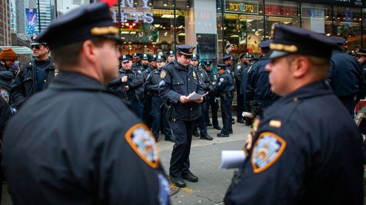

<br>

```{r, out.width = "350%", eval=TRUE, echo=FALSE, warning = F, message = F}
library(knitr)
 # EC: Shiny app of map!
```

<b>Photo Credit</b>: Adapted from Kena Betancur, Agence France-Presse/Getty
Images.

# Introduction

In New York City, Stop-Question-Frisk (SQF) is a police protocol that is 
intended to reduce crime by stopping, questioning, and searching civilians
suspected of engaging in misconduct. It was instituted in the early 2000s, with
SQF incidents peaking in 2011 with almost 700,000 stops [1]. However, the 
program has been frought with controversy, with many asserting that the
program unfairly targets Black and Hispanic individuals at higher rates than
Whites, Asians, or other racial groups. A 2012 statistical analysis indeed 
suggested that this was the case, "even after controlling for precinct 
variability and race-specific estimates of crime participation" [2].

In 2013, a class-action lawsuit on behalf of minority NYC residents against
New York City determined that the SQF program was used in an unconstitutional
way [3]. In settling the lawsuit, the NYPD were required to provide 
justification for any SQF event [4]. Since 2011, the number of SQF events has 
fallen sharply, with slightly over 10,000 SQF stops per year from 2016 onwards.

# Project objectives

The purpose of this case study is to determine whether there may still be 
potential evidence of disparities in SQF events and/or outcomes among Black and 
Hispanic citizens. These may be disparities in the frequency of stops, of who
gets targeted, and actions taken during and/or after the stop, or any other
potential disparity.  

<b>Detailed instructions, the data, and data descriptions are available in the
course [GitHub repository](https://github.com/sta440-sp21)</b>.

# Learning objectives

**Case-specific goals:**

- Review how to correctly write statistical models
- Choose an appropriate modeling approach to evaluate potential associations
- Account for potential confounding factors in a principled way
- Critically evaluate work of other researchers by providing constructive
critiques of their methodology and results

**Overall class goals:**

- Solidify skills in reproducible research and programming, including 
version-control and collaboration via GitHub
- Critically think about reasonable analysis approaches in the context of 
real-world data
- Express statistical models clearly and correctly
- Develop scientific writing skills by providing clear, concise, data-driven 
conclusions suitable for allied researchers

# Project timeline

- **Individual**: Report, reproducible code, and video
  - Due Sunday, January 31
- **Individual**: Peer review and reproduction of results
  - Due Thursday, February 4
  
**Note**: your GitHub report repository and commit history will also be
evaluated by the instructor. The GitHub repository must contain the reproducible
R Markdown document corresponding to the submitted reports, and will be checked
throughout the course of the case study.

# References

[1] Stop, Question, and Frisk Data, 2003 - 2019. Accessed on NYPD website.

[2] Gelman A, Fagan J, Kiss A (2012). "Stop-and-frisk policy in the context of 
claims of racial bias." Journal of the American Statistical Association. 
102(479): 813 - 823.

[3] Floyd, et al. v. City of New York, et al. United States District Court for
the Southern District of New York. 959 F. Supp. 2d 540 (2013).

[4] Mummolo, J (2018). "Modern Police Tactics, Police-Citizen Interactions, and 
the Prospects for Reform". The Journal of Politics. 80: 1–15.