```{r setup, include=FALSE}
# R options
options(
  htmltools.dir.version = FALSE, # for blogdown
  show.signif.stars = FALSE,     # for regression output
  warm = 1
  )
# Set dpi and height for images
library(knitr)
# ggplot2 color palette with gray
color_palette <- list(gray = "#999999", 
                      salmon = "#E69F00", 
                      lightblue = "#56B4E9", 
                      green = "#009E73", 
                      yellow = "#F0E442", 
                      darkblue = "#0072B2", 
                      red = "#D55E00", 
                      purple = "#CC79A7")

options(htmltools.dir.version = FALSE)
knitr::opts_chunk$set(
	fig.align = "center",
	fig.height = 3.75,
	fig.width = 6.25,
	message = FALSE,
	warning = FALSE
)
```

```{r echo=FALSE, message=FALSE, warning=FALSE}
library(tidyverse)
library(knitr)
```

### A disclaimer

The following material was used during a live lecture. Without the accompanying
oral comments and discussion, the text is incomplete as a record of the
presentation. A full recording may be found via Zoom on the course Sakai site.

---

### Why visualization?

```{r, eval=TRUE, echo=FALSE, warning = F, message = F, out.width = "70%"}
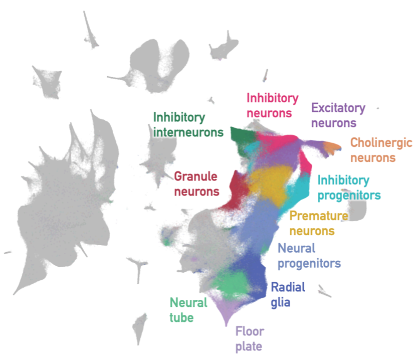
```

.small[Image source: Adapted from Wang, 2020, re: Kobak and Berens (Nat. Commun. 2019) and Cao et al. (Nature 2019).]

---

### Why visualization?

```{r, eval=TRUE, echo=FALSE, warning = F, message = F, out.width = "80%"}
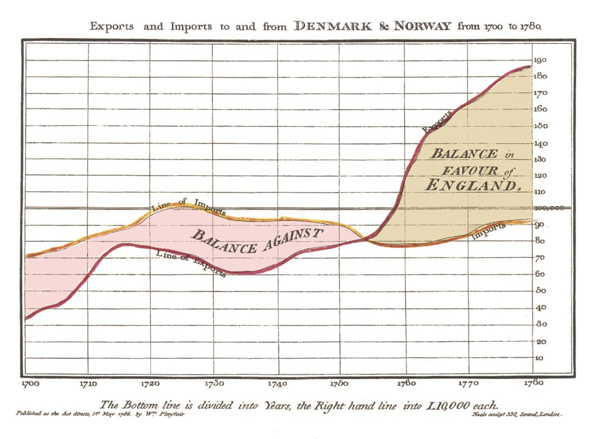
```

.small[Image source: Playfair. 1786 trade balance chart, Commercial and Political Atlas.]

---

### Why visualization?

```{r, echo = F}
dat <- anscombe
options(digits = 3)
```

```{r}
dat
```

---

### Why visualization?

```{r}
dat %>% 
  summarize(meanx1 = mean(x1),
            meanx2 = mean(x2),
            meanx3 = mean(x3),
            meanx4 = mean(x4))
dat %>% 
  summarize(meany1 = mean(y1),
            meany2 = mean(y2),
            meany3 = mean(y3),
            meany4 = mean(y4))
```

---

### Why visualization?

```{r}
dat %>% 
  summarize(sdx1 = var(x1),
            sdx2 = var(x2),
            sdx3 = var(x3),
            sdx4 = var(x4))
dat %>% 
  summarize(sdy1 = sd(y1),
            sdy2 = sd(y2),
            sdy3 = sd(y3),
            sdy4 = sd(y4))
```

---

### Why visualization?

```{r}
dat %>% 
  summarize(cor1 = cor(x1, y1),
            cor2 = cor(x2, y2),
            cor3 = cor(x3, y3),
            cor4 = cor(x4, y4))
```

---

### Why visualization?

```{r}
lm(dat$y1 ~ dat$x1)$coef
lm(dat$y2 ~ dat$x2)$coef
lm(dat$y3 ~ dat$x3)$coef
lm(dat$y4 ~ dat$x4)$coef
```

---

### Why visualization?

```{r, fig.height = 5, fig.width = 8}
par(mfrow = c(2,2))
plot(dat$x1, dat$y1, xlab = "X1", ylab = "Y1", pch = 19)
plot(dat$x2, dat$y2, xlab = "X2", ylab = "Y2", pch = 19)
plot(dat$x3, dat$y3, xlab = "X3", ylab = "Y3", pch = 19)
plot(dat$x4, dat$y4, xlab = "X4", ylab = "Y4", pch = 19)

```

---

### Why visualization?

```{r, echo = F, message = F, warning = F, fig.height = 7, fig.width = 10}
library(visdat)
vis_dat(airquality)
```

---

### What can go wrong?

```{r, eval=TRUE, echo=FALSE, warning = F, message = F, out.width = "100%"}
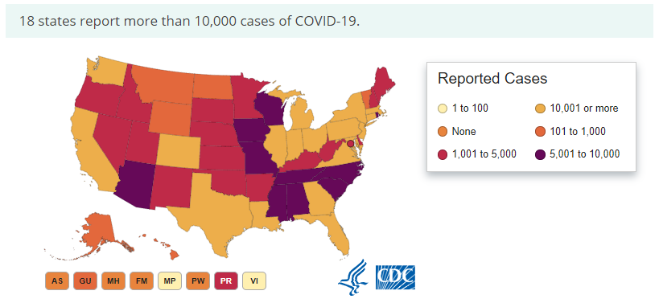
```

.small[Image source: CDC, 2020]

---

### What can go wrong?

```{r, eval=TRUE, echo=FALSE, warning = F, message = F, out.width = "60%"}
include_graphics("img/badvis3.png")
```

.small[Image source: Andrew Yang campaign, 2020]

---

### What can go wrong?

```{r, eval=TRUE, echo=FALSE, warning = F, message = F, out.width = "80%"}
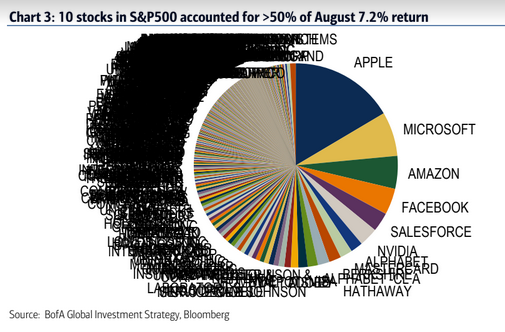
```

---

### What can go wrong?

```{r, eval=TRUE, echo=FALSE, warning = F, message = F, out.width = "80%"}
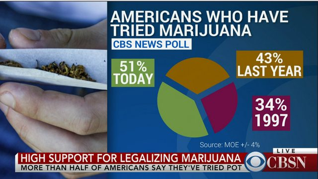
```

---

### What can go wrong?

```{r, eval=TRUE, echo=FALSE, warning = F, message = F, out.width = "55%"}
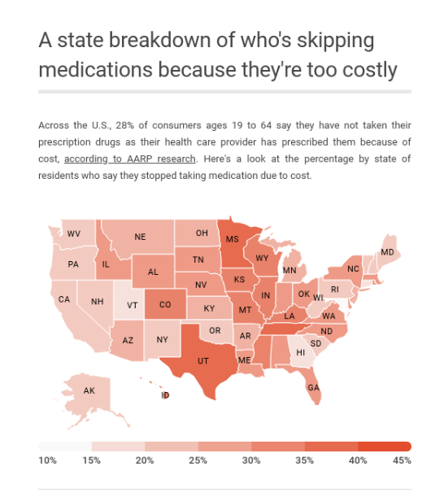
```

.small[Image source: Leonhardt 2020, CNBC]

---

### What can go wrong?

```{r, eval=TRUE, echo=FALSE, warning = F, message = F, out.width = "80%"}
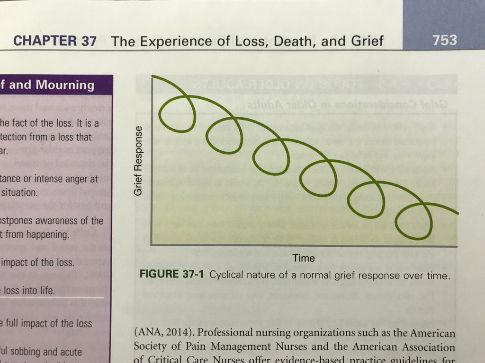
```

.small[Image source: Potter et al., Fundamentals of Nursing]

---

### What can go wrong?

```{r, eval=TRUE, echo=FALSE, warning = F, message = F, out.width = "65%"}
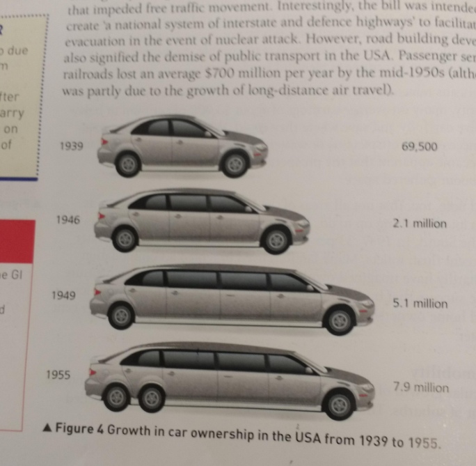
```

.small[Image source: Waugh and Clements, AQA-level History: Making of a Superpower: US 1865-1975]

---

### What can go wrong?

```{r, eval=TRUE, echo=FALSE, warning = F, message = F, out.width = "80%"}
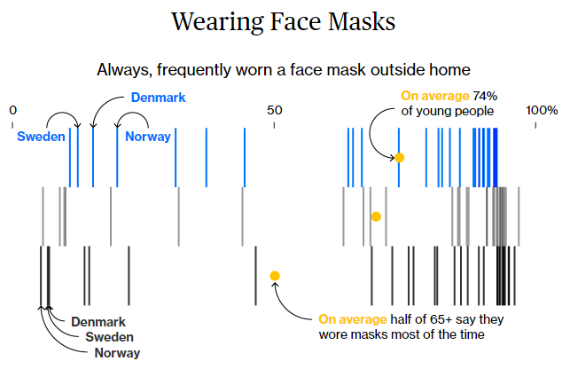
```

.small[Image source: He and Williams for Bloomberg, 2020]

---

### What can go wrong?

```{r, eval=TRUE, echo=FALSE, warning = F, message = F, out.width = "80%"}
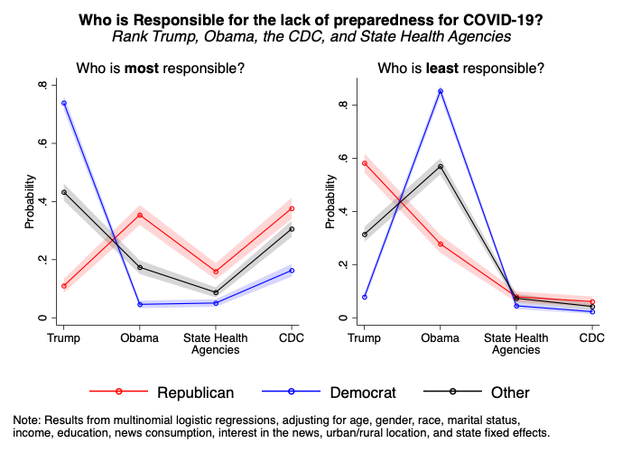
```

.small[Image source: Gadarian, Goodman, and Pepinsky (Draft figure from SSRN 2020)]

---

### What can go wrong?

```{r, eval=TRUE, echo=FALSE, warning = F, message = F, out.width = "80%"}
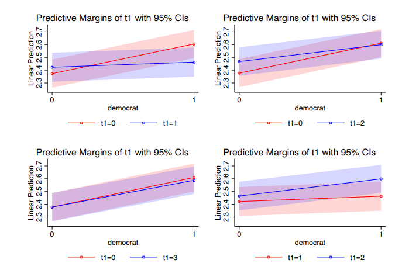
```

.small[Image source: Gadarian, Goodman, and Pepinsky (SSRN 2020)]

---

### Some best practices

- Tell a story; have one in mind when deciding to use a visualization
- Every figure should serve a clear purpose
- A figure should stand on its own 
- Keep it simple and clear

---

### Some best practices

Make sure the type of visualization chosen is correct given the number of
variables included, their types, and their relationships. Some helpful links
are below:

- [The Data Visualization Catalogue](https://datavizcatalogue.com/)
- [The Financial Times Visual Vocabulary](https://github.com/ft-interactive/chart-doctor/tree/master/visual-vocabulary) 

---

### Some best practices

Often, journals will present their own guidelines for visualizations. For 
instance, to submit an article to JAMA, a style guide for figures and their
purposes is provided [here](https://jamanetwork.com/journals/jama/pages/instructions-for-authors#SecTableofFigureRequirements) and contains the most often used 
plots for this particular journal.

```{r, eval=TRUE, echo=FALSE, warning = F, message = F, out.width = "80%"}
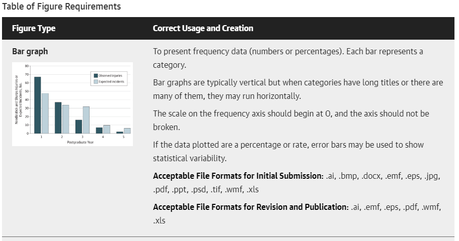
```

---

### Workshop