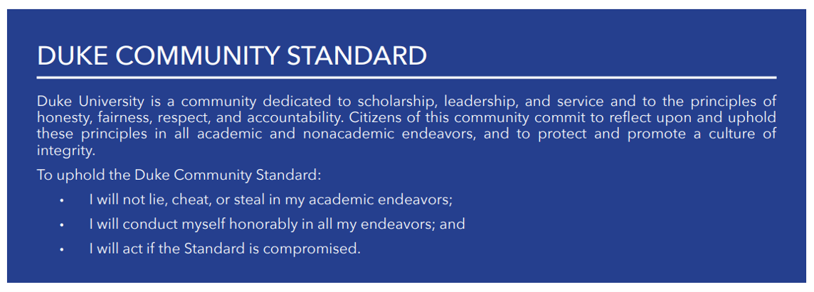
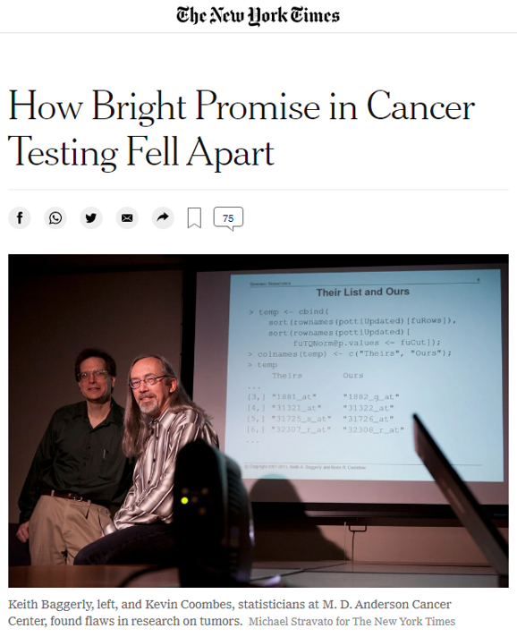
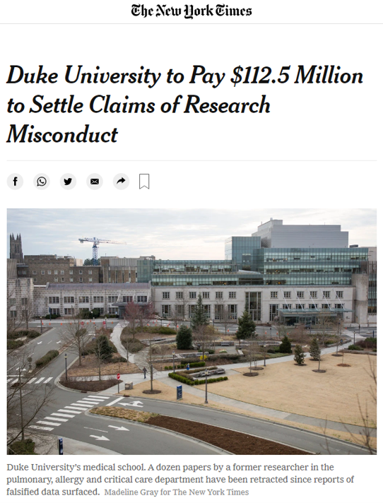
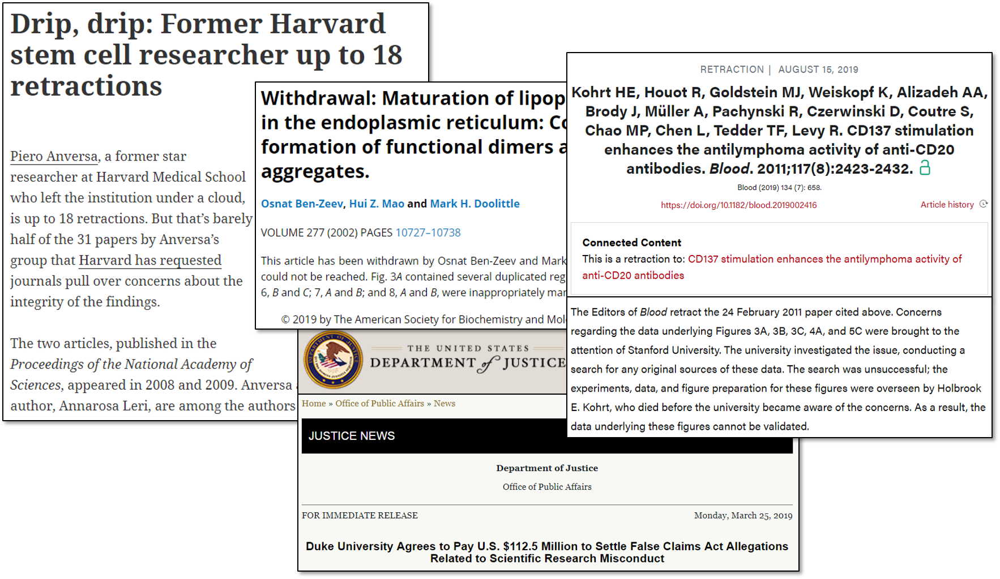
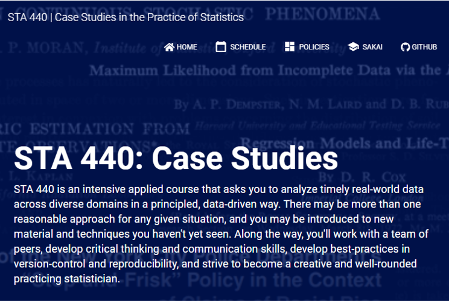

```{r setup, include=FALSE}
# R options
options(
  htmltools.dir.version = FALSE, # for blogdown
  show.signif.stars = FALSE,     # for regression output
  warm = 1
  )
# Set dpi and height for images
library(knitr)
# ggplot2 color palette with gray
color_palette <- list(gray = "#999999", 
                      salmon = "#E69F00", 
                      lightblue = "#56B4E9", 
                      green = "#009E73", 
                      yellow = "#F0E442", 
                      darkblue = "#0072B2", 
                      red = "#D55E00", 
                      purple = "#CC79A7")

options(htmltools.dir.version = FALSE)
knitr::opts_chunk$set(
	fig.align = "center",
	fig.height = 3.75,
	fig.width = 6.25,
	message = FALSE,
	warning = FALSE
)
```

```{r echo=FALSE, message=FALSE, warning=FALSE}
library(tidyverse)
library(knitr)
```

### A disclaimer

The following material was used during a live lecture. Without the accompanying
oral comments and discussion, the text is incomplete as a record of the
presentation. A full recording may be found via Zoom on the course Sakai site.

---

### Academic and research integrity

.question[
How do you define academic and research integrity? How do you define academic and research misconduct?
]

---

### Academic and research integrity

From the [National Institutes of Health](https://grants.nih.gov/policy/research_integrity/what-is.htm):

*Research integrity includes:*

- *the use of honest and verifiable methods in proposing, performing, and* 
*evaluating research*
- *reporting research results with particular attention to adherence to rules,*
*regulations, guidelines, and*
- *following commonly accepted professional codes or norms.*

"Let the facts speak for themselves and avoid improper bias."

---

### Academic and research integrity

According to the U.S. Department of Health and Human Services 
[Office of Research Integrity](https://ori.hhs.gov/definition-misconduct), 
the following activities are examples of research misconduct:

- .vocab[Fabrication]: *"making up data or results and recording or reporting them."*
- .vocab[Falsification]: *"manipulating research materials, equipment, or processes, or changing or omitting data or results such that the research is not accurately represented in the research record."*
- .vocab[Plagiarism]: *"the appropriation of another person's ideas, processes, results, or words without giving appropriate credit."*

---

### Academic and research integrity

```{r, eval=TRUE, echo=FALSE, warning = F, message = F, out.width = "100%"}

```

[Read about how to uphold the Duke Community Standard in practice](https://registrar.duke.edu/university-bulletins/duke-community-standard).

---

### Why does integrity matter?

.question[
What are potential consequences if academic or research misconduct is found to
have occurred?
]

---

### Why does integrity matter?

```{r, eval=TRUE, echo=FALSE, warning = F, message = F, out.width = "50%"}

```

<!-- [Article available here.](https://www.nytimes.com/2011/11/03/health/research/noted-dutch-psychologist-stapel-accused-of-research-fraud.html) -->

---

### Why does integrity matter?

```{r, eval=TRUE, echo=FALSE, warning = F, message = F, out.width = "50%"}

```

<!-- [Article available here.](https://www.nytimes.com/2011/11/03/health/research/noted-dutch-psychologist-stapel-accused-of-research-fraud.html) -->

---

### Why does integrity matter?

.question[
Choose one example of research misconduct as detailed by the case summaries [on this webpage](https://ori.hhs.gov/case_summary). How did the researcher engage in misconduct? What were the consequences for them? What were the consequences for others?
]

---

### Reproducibility and replicability

.vocab[Reproducibility]: being able to take the original data and code to
reproduce all numerical findings

.vocab[Replicability]:  being able to independently repeat an entire study
without use of the original data (generally with the same methods)

Some best practices from the ASA:

- End-to-end scripting of research
- Use of version control and documentation
- Publication of code and data

---

### Reproducibility and replicability

```{r, eval=TRUE, echo=FALSE, warning = F, message = F, out.width = "70%"}
include_graphics("img/crisis.jpeg")
```

["1,500 scientists lift the lid on reproducibility" - Nature](https://www.nature.com/news/1-500-scientists-lift-the-lid-on-reproducibility-1.19970)

---

### Reproducibility and replicability

```{r, eval=TRUE, echo=FALSE, warning = F, message = F, out.width = "100%"}

```

---

### What else can go wrong?

```{r, eval=TRUE, echo=FALSE, warning = F, message = F, out.width = "70%"}

```

[Selection bias, reporting bias, non-response bias, attrition bias, spin bias, confounding, and so much more](https://catalogofbias.org/biases/)

---

### What else can go wrong?

.question[
The left chart is adapted from a 2011 Fox Business graphic. What is misleading 
about it, and how does it compare to the graphic on the right?
]

```{r, eval=TRUE, echo=FALSE, warning = F, message = F, out.width = "70%"}
include_graphics("img/axis-start-at-0.png")
```


[How charts lie - Alberto Cairo](https://www.washingtonpost.com/business/2019/10/14/youve-been-reading-charts-wrong-heres-how-pro-does-it/)

---

### Data privacy and provenance

.question[
How important is protecting the privacy of individuals? How important is "where the data come from"? If data are available to the public, does that automatically mean it doesn't violate reasonable expectations of privacy?
]

---

### What have I gotten myself into?

```{r, eval=TRUE, echo=FALSE, warning = F, message = F, out.width = "80%"}

```

[Read the course website, syllabus, and schedule here](https://www2.stat.duke.edu/courses/Spring21/sta440.001/)