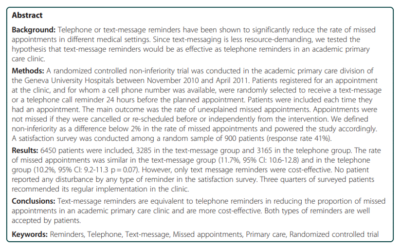
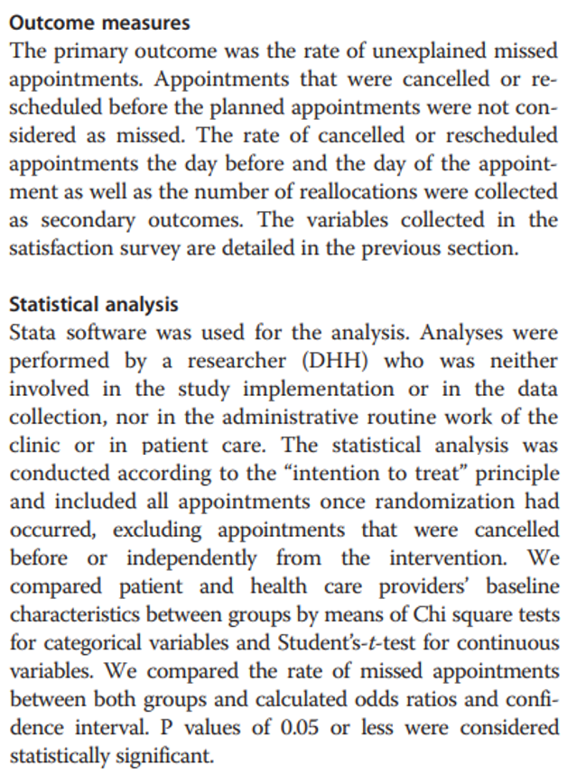
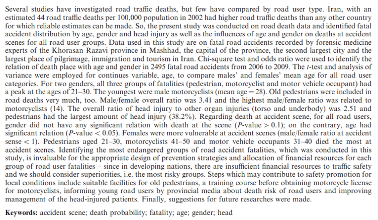
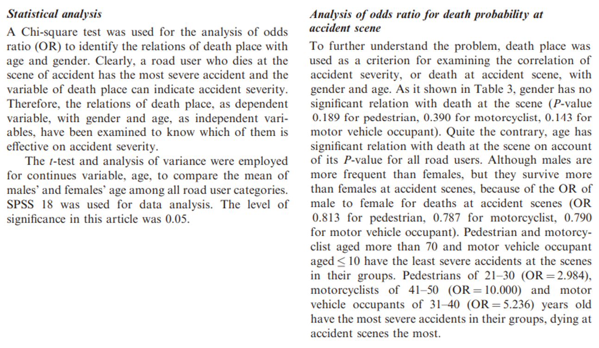
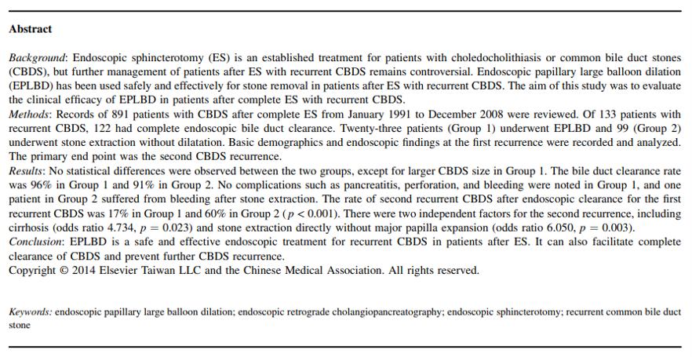
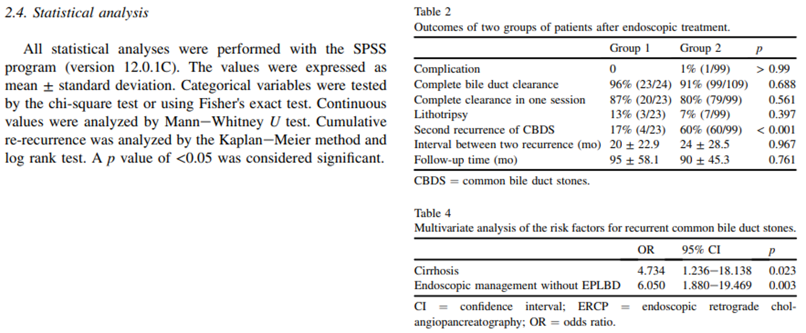
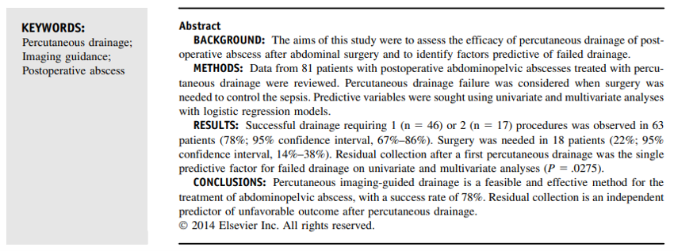
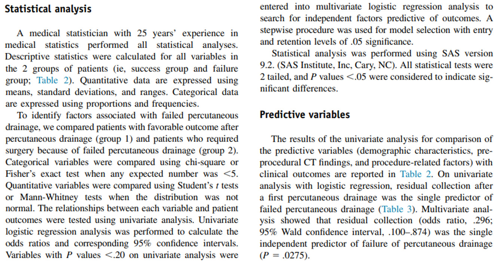

```{r setup, include=FALSE}
# R options
options(
  htmltools.dir.version = FALSE, # for blogdown
  show.signif.stars = FALSE,     # for regression output
  warm = 1
  )
# Set dpi and height for images
library(knitr)
# ggplot2 color palette with gray
color_palette <- list(gray = "#999999", 
                      salmon = "#E69F00", 
                      lightblue = "#56B4E9", 
                      green = "#009E73", 
                      yellow = "#F0E442", 
                      darkblue = "#0072B2", 
                      red = "#D55E00", 
                      purple = "#CC79A7")

options(htmltools.dir.version = FALSE)
knitr::opts_chunk$set(
	fig.align = "center",
	fig.height = 3.75,
	fig.width = 6.25,
	message = FALSE,
	warning = FALSE
)
```

```{r echo=FALSE, message=FALSE, warning=FALSE}
library(tidyverse)
library(knitr)
```

### A disclaimer

The following material was used during a live lecture. Without the accompanying
oral comments and discussion, the text is incomplete as a record of the
presentation. A full recording may be found via Zoom on the course Sakai site.

---

### What even is peer review?

.vocab[Peer review] is the "expert assessment of submitted materials" (Walker)
and is used to help ensure that published materials are of high quality and
free from mistakes. It is used to maintain quality standards and credibility
in shared results. Many times peer review is blinded, which allows for more
honest and constructive comments.

Peer review is *not* limited to academic settings and journal submissions!

---

### What even is peer review?

Peer reviewers are tasked with providing a dispassionate evaluation of the work
in question - this review is often used for decision-making purposes on behalf
of a larger institution.

Useful peer reviews provide helpful feedback (both positive and negative) about
the relative strengths and weaknesses of the piece being reviewed. 

Just because there are no mistakes doesn't necessarily mean that an article is
worthy of publication!

---

### Dos and don'ts of peer review

.question[
Always keep the overall goal in mind: to provide an objective evaluation of the
work in question
]

- See Sakai for further resources and items to consider (we won't discuss in
class; there are interactive activities to do!)
- Use Case 00 peer review checklist and questions asked in assignment 
repositories
as the basis for your own peer review!
- **Describe - Evaluate - Suggest** framework

---

### Example 1

```{r, eval=TRUE, echo=FALSE, warning = F, message = F, out.width = "100%"}

```

---

### Example 1

```{r, eval=TRUE, echo=FALSE, warning = F, message = F, out.width = "100%"}

```

---

### Example 1

```{r, eval=TRUE, echo=FALSE, warning = F, message = F, out.width = "50%"}

```

---

### Example 2

```{r, eval=TRUE, echo=FALSE, warning = F, message = F, out.width = "100%"}

```

---

### Example 2

```{r, eval=TRUE, echo=FALSE, warning = F, message = F, out.width = "100%"}

```

---

### Example 2

```{r, eval=TRUE, echo=FALSE, warning = F, message = F, out.width = "100%"}

```

---

### Example 3

```{r, eval=TRUE, echo=FALSE, warning = F, message = F, out.width = "100%"}

```

---

### Example 3

```{r, eval=TRUE, echo=FALSE, warning = F, message = F, out.width = "100%"}

```

---

### Example 3

```{r, eval=TRUE, echo=FALSE, warning = F, message = F, out.width = "100%"}

```

---

### Example 4

```{r, eval=TRUE, echo=FALSE, warning = F, message = F, out.width = "100%"}

```

---

### Example 4

```{r, eval=TRUE, echo=FALSE, warning = F, message = F, out.width = "100%"}

```

---

### Example 4

```{r, eval=TRUE, echo=FALSE, warning = F, message = F, out.width = "100%"}

```