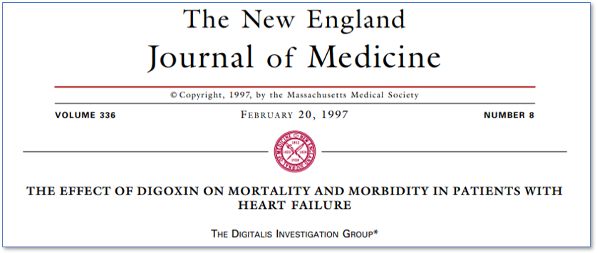

```{r, echo = F, warning = F, message = F}
library(survival)
library(tidyverse)

dig <- read.csv("C:/Users/Yue/Courses/STA 440 2021 Spring/docs/datasets/UNUSED_dig_teaching/DIG_csv/DIG_csv/dig.csv")
```

### A disclaimer

Today's (and last time's) lectures are introductory surface level treatments of
survival analysis. We focus on applications and use cases -- there are no 
theoretical results presented (even for important subjects like variance
estimation). 

There is much to discuss regarding survival analysis both theoretically and in 
application. In STA 440, we will focus on using and implementing commonly used
methods to tackle real-world datasets instead of focusing on theoretical
considerations.

---

### The DIG Trial

```{r, echo=FALSE, out.width = '120%'} 

```

Investigators compared the **primary outcome** of the number of days from the
start of the study to either death or hospitalization from worsening heart
failure.

---

### Representing survival data

Underlying data:
- $T$: Failure time, a non-negative random variable
- $C$: Censoring time, a non-negative random variable
Observed data for individual $i$:
- $Y_i$: $(T_i \wedge C_i)$, the minimum of $T_i$ and $C_i$
- $\delta_i$: $1_{(T_i \le C_i)}$, whether we observe a failure

If $\delta_i = 0$, then we have .vocab[right-censoring]: the survival time is
longer than the censoring time.

Commonly, we assume $C_i$ are *i.i.d.* random variables with some distribution
and that the censoring mechanism is *independent* of the failure mechanism.

---

### Characterizing continuous $T$

- Density function: $f(t) = \lim_{\Delta t \to 0^+} \frac{P(t \le T < t + \Delta t)}{\Delta t}$

- Distribution function: $F(t) = P(T \le t) = \int_0^t f(s)ds$

- Survival function: $S(t) = P(T > t) = 1 - F(t)$

- Hazard function: $\lambda(t) = \lim_{\Delta t \to 0^+} \frac{P(t \le T < t + \Delta t | T \ge t)}{\Delta t}$

- Cumulative hazard function: $\Lambda(t) = \int_0^t \lambda(s)ds$

Knowing one is equivalent to knowing the others.

---

### Hazard distributions

Exponential distribution:

- $f(t) = \lambda e^{-\lambda t}$ (don't get the rate parameter $\lambda$ 
confused with the hazard)
- $F(t) = 1 - e^{-\lambda t}$
- $S(t) = e^{-\lambda t}$
- $\lambda(t) = \lambda$
- $\Lambda(t) = \lambda t$

.vocab[
What do you notice about the hazard for survival times that have an exponential 
distribution?
]

---

### Hazard distributions

Weibull distribution:

- $f(t) = p\lambda^p t^{p - 1}e^{-(\lambda t)^p}$
- $F(t) = 1 - e^{-(\lambda t)^p}$
- $S(t) = e^{-(\lambda t)^p}$
- $\lambda(t) = p\lambda^p t^{p - 1}$
- $\Lambda(t) = (\lambda t)^p$

When the shape parameter $p$ is 1, then we have the exponential distribution.

The hazard increases monotonically over time if $p > 1$ and decreases 
monotonically if $p < 1$ (is this reasonable to assume?).

---

### Hazard distributions

Plotting Weibull hazard with $\lambda = 1$ and various shape parameters $p$:

```{r, echo = F, fig.align = 'center'}
xs <- seq(0, 4, by = 0.002)
y1 <- rep(1, length(xs))
y2 <- 0.5*xs^(0.5-1)
y2 <- 2*xs^(2-1)
y3 <- 0.25*xs^(0.25-1)
y4 <- 4*xs^(4-1)
plot(xs, y1, type = "l", ylim = c(0,4), xlab = "Time", ylab = "Hazard")
lines(xs, y2, col = "red")
lines(xs, y3, col = "blue")
lines(xs, y4, col = "gray")
```

---

### Hazard distributions

Log-normal distribution:

- $f(t) = \frac{1}{t \sigma}\phi\left(\frac{\log(t) - \mu}{\sigma} \right)$
- $F(t) = \Phi\left(\frac{\log(t) - \mu}{\sigma} \right)$
- $S(t) = 1 - F(t)$
- $\lambda(t) = f(t)/S(t)$
- $\Lambda(t) = \int_0^t \lambda(s)ds$

---

### Hazard distributions

Plotting log-normal hazard with $\mu = 0$ and $\sigma^2 = 1$:

```{r, echo = F, fig.align = 'center'}
xs <- seq(0, 4, by = 0.001)
y1 <- dnorm(log(xs))/((1-pnorm(log(xs)))*xs)
plot(xs, y1, type = "l", ylim = c(0,1), xlab = "Time", ylab = "Hazard")
```

---

### Review: comparing multiple groups

```{r, message = F, warning = F, fig.height = 4, fig.align = 'center'}
library(survminer)
ggsurvplot(survfit(Surv(DWHFDAYS, DWHF) ~ TRTMT, data = dig), 
     xlab = "Days", ylab = "Est. Survival Probability",
     ylim = c(0, 1),
     conf.int = T, censor = F, 
     legend.labs = c("Placebo", "Digoxin"))
```

---

### Review: comparing multiple groups

```{r}
survdiff(Surv(DWHFDAYS, DWHF) ~ TRTMT, data = dig)
```

.question[
How might we adjust for potential confounders? Is there any way to create
a predictive model for survival time?
]

---

### An accelerated failure time model

An .vocab[accelerated failure time] (AFT) model assumes

\begin{align*}
\log(T_i) = \beta_0 + \beta_1x_1 + \beta_2x_2 + \cdots + \beta_px_p + \epsilon_i
\end{align*}

where $\epsilon_i$ are commonly assumed to be i.i.d. and follow some specified
distribution.

There is a one-to-one relationship between the distribution of $T$ and the
assumed error distribution in the AFT model.

For instance, if $\epsilon$ has a normal distribution, then $T$ has a log-normal 
distribution. If $\epsilon$ has a gen. EV distribution, then $T$
has a Weibull distribution, etc. 

In software packages, these models are often fit by specifying the distribution
of $T$.

---

### An accelerated failure time model

Note that we can also write the AFT model as

\begin{align*}
T_i &= \exp\left(\beta_0 + \beta_1x_{1i} + \beta_2x_{2i} + \cdots + \beta_px_{pi} \right)e^{\epsilon_i}\\
&= e^{\beta_0}e^{\beta_1x_{1i}}e^{\beta_2x_{2i}}\cdots e^{\beta_px_{pi}}e^{\epsilon_i}
\end{align*}

Covariates in an AFT model have a multiplicative effect on *time*. For instance,
if $\beta_k = 0.4$, then $\exp(\beta_k) \approx 1.5$. Holding all else equal,
an individual with covariate $x_k$ one unit greater than another is expected
to survive approximately 1.5 times longer than the other.

---

### Fitting an AFT model

```{r, message = F, warning = F}
library(survival)
aft_e <- survreg(Surv(DWHFDAYS, DWHF) ~ TRTMT + EJF_PER + PREVMI, 
                 data = dig, dist = "exponential")
summary(aft_e)
```

---

### Fitting an AFT model

```{r, message = F, warning = F}
library(survival)
aft_w <- survreg(Surv(DWHFDAYS, DWHF) ~ TRTMT + EJF_PER + PREVMI, 
                 data = dig, dist = "weibull")
summary(aft_w)
```

---

### A proportional hazards model

\begin{align*}
\lambda(t) &= \lambda_0(t)\exp\left(\beta_1x_1 + \beta_2x_2 + \cdots + \beta_px_p \right)
\end{align*}

where the .vocab[baseline hazard] is assumed to have some distribution 
(or maybe not!...more on that in just a bit). 

Covariates in a PH model have a multiplicative effect on *hazards*. For
instance, if $\beta_k = 0.4$, then $\exp(\beta_k) \approx 1.5$. Holding all else 
equal, an individual with covariate $x_k$ one unit greater than another is 
expected to have approximately 1.5 times the *hazard* of the event than the
other.

.question[
Would you rather have a higher linear predictor or a lower linear predictor
in a PH model? How does this compare to the AFT model?
]

---

### A proportional hazards model

```{r, echo = F, fig.align = 'center'}
xs <- seq(0, 10, by = 0.001)
y1 <- dbeta(xs/10, 4, 8)
y2 <- 0.5*y1
y3 <- 0.25 * y1
y4 <- 2*y1
plot(xs, y1, type = "l", lwd = 2, col = "red", ylim = c(0, 6),
     xlab = "Time", ylab = "Hazard")
lines(xs, y3)
lines(xs, y4)
```

---

### Fitting a PH model

```{r, message = F, warning = F}
library(eha)
ph_ln <- phreg(Surv(DWHFDAYS, DWHF) ~ TRTMT + EJF_PER + PREVMI, 
               data = dig, dist = "lognormal")
ph_ln
```

.vocab[
How might we interpret the coefficient estimates here? How do they relate to
our previous models?
]

---

### The Cox proportional hazards model

\begin{align*}
\lambda(t) &= \lambda_0(t)\exp\left(\beta_1x_1 + \beta_2x_2 + \cdots + \beta_px_p \right)
\end{align*}

In a parametric survival model (such as ones we've seen), the survival times
are assumed to follow a specific distribution, which is a fairly strong
assumption.

--

Often times, we only care about the $\beta$ terms and not so much the 
$\lambda_0$. Using the concept of partial likelihood, Cox (1972) found that we 
can "separate" inference for the $\beta$ terms from $\lambda_0$. 

The Cox model is a *semiparametric* survival model; $\lambda_0(t)$ is left 
completely unspecified, with no assumptions made on its shape. (A
semi-parametric version of the AFT model also exists, but isn't very popular).

---

### The Cox proportional hazards model

- By far the most commonly used regression model for survival data
- Attractive interpretations using hazard ratios
- Can be extended to accommodate time-varying covariates, recurrent events, etc.
- Fewer assumptions than fully parametric models, but still requires PH 
assumption
- Can compare nested models by using partial likelihood ratio statistic, which
has asymptotic $\chi^2$ distribution (df = difference in number of parameters)

---

### Fitting the Cox PH model

```{r}
coxm1 <- coxph(Surv(DWHFDAYS, DWHF) ~ TRTMT + EJF_PER + PREVMI, 
                    data = dig)
summary(coxm1)
```

.question[
How might we interpret these coefficients? How do they compare to our previous
models?
]

---

### Fitting the Cox PH model

The strength of the Cox model is that we can ignore estimation of $\lambda_0$
completely (it doesn't matter for valid inference on the $\beta$s).

If we want to estimate survival probabilities, then we must estimate the 
baseline hazard. A non-parametric estimator (the .vocab[Breslow estimator]) is 
implemented by the `basehaz` function in the `survival` package (confusingly, 
this is of the *cumulative* hazard). It is given by:

\begin{align*}
\hat{\Lambda}_0(t) = \sum_{i:t_{(i)} < t} \frac{1}{\sum_{j \in R_i} \exp(\mathbf{X}_j\beta)}
\end{align*}

We can then estimate survival in the Cox model by:

\begin{align*}
\hat{S}(t|\mathbf{X}) = \exp(-\exp(\mathbf{X}\beta) \hat{\Lambda}_0(t))
\end{align*}

---

### Cox model diagnostics

Recall the inverse CDF result: if $T_i$ has survival function $S_i(t)$, then
$S_i(T_i)$ should have a uniform distribution on (0, 1) and $\Lambda_i(T_i)$
should follow Exp(1) distribution.

Thus, if the model is correct, then the estimated cumulative hazard $\hat{\Lambda}$
at observed times should be a censored sample from Exp(1). These $\hat{\Lambda}_i(Y_i)$
are known as .vocab[Cox-Snell residuals].

--

Plotting $\log(-\log\hat{S}(Y_i))$ against $\log(Y_i)$ should thus follow a 
straight line through the origin at a 45-degree angle. 

Although Cox-Snell residuals can also be used for other models (e.g., checking
whether distribution specified in AFT model is appropriate), they're not too
useful in practice (for a variety of reasons).

---

### Cox model diagnostics

To assess PH assumption, we can examine .vocab[Schoenfeld residuals]. 
Intuitively, each Schoenfeld residual is the difference between the observed
covariate and the expected covariate for each observed failure, conditioned on
the risk set at that time.

In plotting Schoenfeld residuals vs. survival times, we expect to see them
randomly distributed around 0.

---

### Cox model diagnostics

.vocab[Martingale residuals] are based on the difference between observed number 
of events up until time $Y_i$ and the expected count based on the fitted model.

.vocab[Deviance residuals] are a normalized transformation of the martingale
residuals that correct their skewness. They should be randomly distributed 
around mean 0 with a variance of 1.

In practice, these residuals are useful for finding potential outliers: negative
values "lived longer than expected" and positive values "died too soon."

---

### Cox model diagnostics

```{r, message = F, warning = F, fig.height = 6, fig.width = 10}
library(survminer)
ggcoxdiagnostics(coxm1, type = "schoenfeld")
```

---

### Cox model diagnostics

```{r, message = F, warning = F, fig.height = 6, fig.width = 10}
library(survminer)
ggcoxdiagnostics(coxm1, type = "deviance", linear.predictions = F)
```